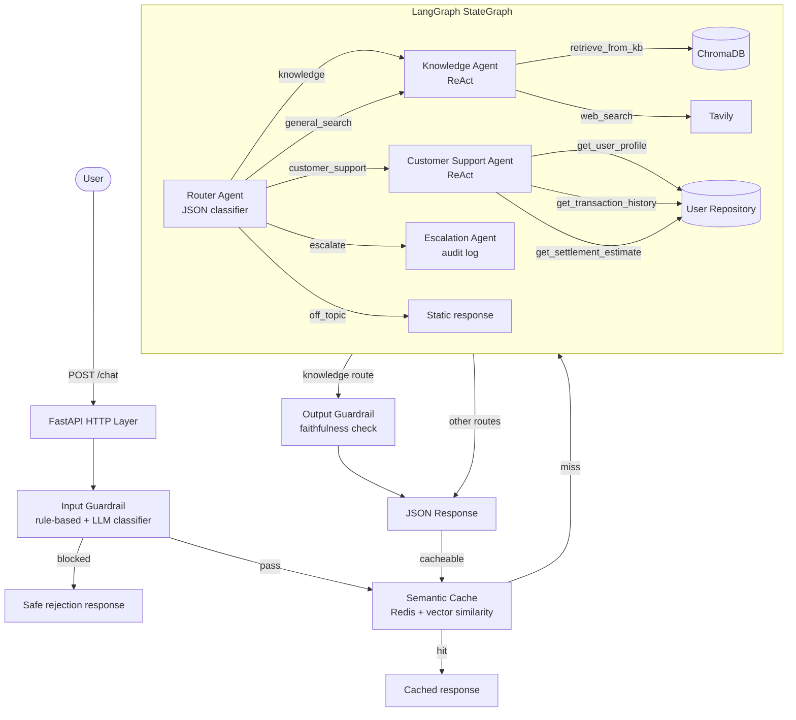

# Getnet Multi-Agent Support System

A production-quality multi-agent customer support system for Getnet, built with Clean Architecture, LangGraph, RAG, and full observability.

---

## Architecture Overview



### Agent Responsibilities

| Agent | Route | Tools | Purpose |
|---|---|---|---|
| **Router Agent** | — | none | Classifies intent via structured JSON output |
| **Knowledge Agent** | `knowledge`, `general_search` | `retrieve_from_kb`, `web_search` | RAG + web search via ReAct loop |
| **Customer Support Agent** | `customer_support` | `get_user_profile`, `get_transaction_history`, `get_settlement_estimate` | Account & transaction data retrieval |
| **Escalation Agent** | `escalate` | none | Logs escalation events to Redis audit trail |
| Off-topic handler | `off_topic` | none | Static polite deflection |

---

## RAG Pipeline

```
Scraper (15 Getnet pages)
    ↓
RecursiveCharacterTextSplitter (512 tokens, 64 overlap)
    ↓
HuggingFace bi-encoder: all-MiniLM-L6-v2
    ↓
ChromaDB (cosine similarity, persistent volume)
    ↓  [at query time]
Top-k retrieval → CrossEncoder reranker (ms-marco-MiniLM-L-6-v2) → top-n chunks
    ↓
Formatted context → Knowledge Agent → LLM response
```

**Key decisions:**
- Bi-encoder for fast ANN retrieval; cross-encoder reranker for precision
- Deterministic chunk IDs (SHA-256) make re-ingestion idempotent
- Semantic cache (Redis + vector similarity ≥ 0.92) deduplicates near-identical queries

---

## Guardrails

**Input guardrail** (pre-routing, two layers):
1. Regex patterns — prompt injection, jailbreak attempts
2. LLM classifier with plain-text fallback if structured output fails

**Output guardrail** (post-knowledge-agent):
- Faithfulness check: verifies answer is grounded in retrieved context
- Uses a separate judge model (DeepSeek) intentionally different from the generator to avoid self-reporting bias

---

## Observability & Evaluation

- **Langfuse v4**: every LLM call, tool invocation, and agent node traced with user/session context
- **DeepEval**: async evaluation suite (ARQ job) over a 15-scenario golden dataset
  - Metrics: Faithfulness, Answer Relevancy, Contextual Relevancy, Contextual Precision, Contextual Recall, Routing Accuracy
  - Results stored in Redis and exposed via `GET /admin/eval/latest`

---

## Prerequisites

- Docker Desktop ≥ 24
- DeepSeek API key — [platform.deepseek.com](https://platform.deepseek.com)
- Tavily API key — [app.tavily.com](https://app.tavily.com) (free tier)
- Langfuse account — [us.cloud.langfuse.com](https://us.cloud.langfuse.com) (free tier)

---

## Setup & Run

### 1. Configure environment

```bash
cp .env.example .env
# Fill in: LLM_API_KEY, SEARCH_API_KEY, LANGFUSE_PUBLIC_KEY, LANGFUSE_SECRET_KEY
```

### 2. Build images

```bash
docker compose build app
docker compose build arq-worker   # reuses cached layers
docker compose build ingest
```

### 3. Start the stack

```bash
docker compose up -d
```

Services: `app` → port 8080, `chromadb` → port 8000, `redis` → port 6379, `arq-worker`.

### 4. Ingest the knowledge base

```bash
# Option A — one-shot container
docker compose run --rm ingest

# Option B — via API (enqueues ARQ job)
curl -X POST "http://localhost:8080/admin/ingest?force=true"
```

### 5. Test the API

```bash
# Swagger UI
open http://localhost:8080/docs

# 10-scenario smoke test
bash scripts/smoke_test.sh       # Linux/macOS
./scripts/smoke_test.ps1         # Windows PowerShell
```

---

## API Reference

| Method | Path | Description |
|---|---|---|
| `POST` | `/chat` | Main chat endpoint |
| `GET` | `/health` | Liveness probe |
| `GET` | `/ready` | Readiness probe (Redis + ChromaDB) |
| `POST` | `/admin/ingest` | Enqueue ingestion job (`?force=true` to re-ingest) |
| `POST` | `/admin/eval` | Enqueue DeepEval suite |
| `GET` | `/admin/eval/latest` | Latest evaluation results |
| `GET` | `/admin/escalations/{user_id}` | Escalation audit log |

**Request body (`/chat`):**
```json
{
  "message": "How does receivables advance work with Getnet?",
  "user_id": "cliente1988",
  "session_id": "optional-uuid"
}
```

---

## Running Tests

```bash
# Unit tests only (no external services needed)
uv run pytest src/__tests__/unit -v

# Full suite
uv run pytest
```

---

## Project Structure

```
src/
├── domain/          # Entities, ports (interfaces), shared state — zero external deps
├── application/     # Agents, RAG pipeline, guardrails, jobs — pure business logic
├── infrastructure/  # Adapters: ChromaDB, Redis, DeepSeek, Tavily, Langfuse, HuggingFace
├── interface/       # FastAPI routes, ARQ worker settings
└── _lib/            # Dependency injection container (dependency-injector)
```

Clean Architecture: domain has zero framework dependencies. All external services sit behind ports with concrete adapters in infrastructure.

---

## Design Decisions

| Decision | Choice | Rationale |
|---|---|---|
| Orchestration | LangGraph StateGraph | Explicit state transitions, conditional routing, built-in ReAct |
| LLM provider | DeepSeek v4-flash | OpenAI-compatible API, strong reasoning, cost-effective |
| Vector store | ChromaDB (self-hosted) | No cloud dependency; persistent Docker volume |
| Embeddings | all-MiniLM-L6-v2 | Small, fast, high quality for semantic similarity |
| Reranker | ms-marco-MiniLM-L-6-v2 | Cross-encoder precision at retrieval time |
| Cache | Redis + vector similarity | Near-duplicate deduplication with configurable threshold |
| Background jobs | ARQ | Lightweight, async-native, cron support |
| Observability | Langfuse Cloud | Free tier, no extra container, real-time traces |
| Evaluation | DeepEval + independent judge | Separate judge model avoids self-grading bias |
| DI | dependency-injector | Explicit wiring, fully testable, no magic |
